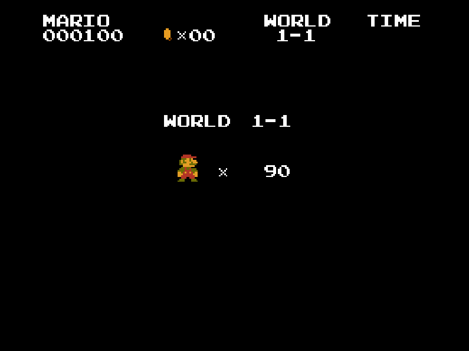

# Mario Q-Learning

This project experiments with deep Q-learning networks applied to Mario. A three-layer perceptron with ReLU activation layers is used to train a Mario agent. State vectors are represented using Mario mode, direction, and enemy positions. Positive rewards are obtained for moving forward, while negative rewards are obtained for dying.

## Usage
Train: ``python mario_level_1.py``

## Demo
Below is a gif of the agent during training:

Credits:
Pygame code from https://github.com/justinmeister/Mario-Level-1